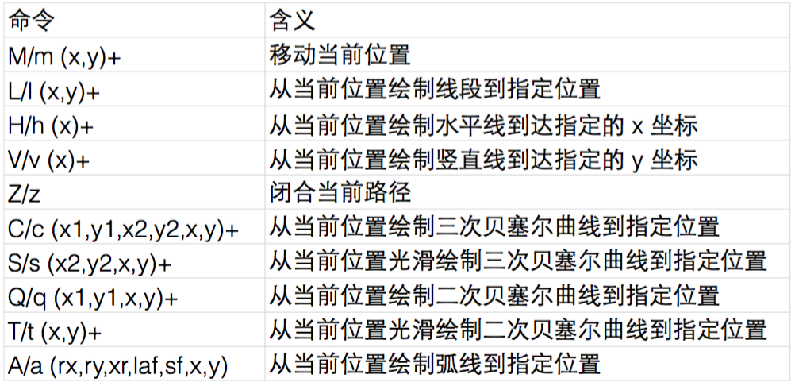

## chap1、svg入门

1. svg简介 - 使用方式
* 在浏览器中直接打开；
* 在html中使用img标签；
* 直接在html中使用svg标签；
* 作为css背景；
2. 基本图形和属性
* 基本图形：\<rect> \<circle> \<ellipse> \<line> \<polyline> \<polygon>
* 基本属性：fill、stroke、stroke-width、transform
3. 基本操作API
* 创建图形：document.createElementNS(na,tagName)
* 添加图形：element.appendChild(childElement)
* 获取、设置属性：element.getAttribute(name)、element.setAttribute(name,value)

## chap2、坐标系统与坐标变换
1. viewBox、preserveAspectRatio
2. svg图形分组：\<g>标签
3. 坐标系统；4、坐标系；5、坐标变换

## chap3、颜色、渐变和笔刷
1. RGB 和 HSL
2. 线性渐变和径向渐变
* 线性渐变：\<linearGradient>、\<stop>、gradientUnits
* 径向渐变：\<radialGradient>、\<stop>、gradientUnits
3. 笔刷  
绘制纹理、\<pattern>标签、patternUnits(objectBoundingBox|userSpaceOnUse)、patternContentUnits(objectBoundingBox|userSpaceOnUse)

## chap4、Path
1. path概述
* 区分大小写：大写表示坐标参数为绝对位置，小写则为相对位置。
* 最后的参数表示最终要到达的位置。
* 上一个命令结束的位置就是下一个命令开始的位置。
* 命令可以重复参数表示重复执行同一条命令。
2. 各种path命令

## chap5、SVG文本

1. \<text> 和 \<tspan> 创建文本  
(1) x 和 y 属性 - 定位标准；(2) dx 和 dy 属性 - 字形偏移；(3) style属性 - 设置样式。
2. 垂直居中  
(1)text-anchor - 水平居中属性；(2)dominant-baseline属性；(3)脚本模拟竖直方向的居中。
3. \<textpath> 路径文本
4. \<a> 超链接  
(1) 可以添加到任意的图形上；(2) xlink:href 指定链接地址；(3) xlink:title 指定链接提示；(4) target 指定打开目标。

## chap6、svg动画
1. SMIL for SVG
* 动画标签：\<animate>、\<animateTransform>、\<animateMotion>
* 动画元素、属性定位以及动画参数设置：attributeName、attributeType、from、to、dur、repeatCount、fill、calcMode
* SMIL for SVG 定位动画目标
Internal Rasource Identifier 定位：例如 \<animate xlink:href="#rect1">\</animate>  
被包含在目标元素里：\<rect> \<animate>\</animate> \</rect>  
* SMIL for SVG 轨迹移动

> svg官方查阅文档：[https://www.w3.org/TR/SVG/](https://www.w3.org/TR/SVG/ "SVG")
